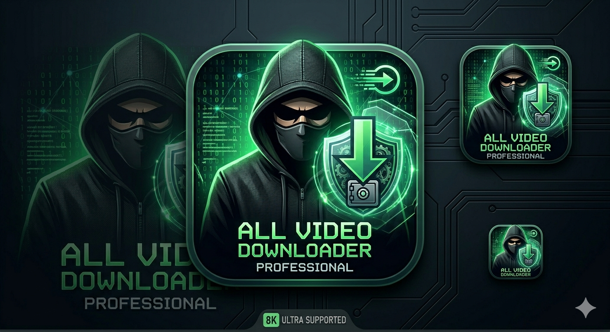

# 🚀 Video Vortex

<div align="center">



[](https://github.com/the-cybercaptain/video-vortex/stargazers)

[](https://github.com/the-cybercaptain/video-vortex/network)

[](https://github.com/the-cybercaptain/video-vortex/issues)

[](LICENSE)

[](https://www.python.org/)

**A high-performance, cross-platform video & audio download engine supporting 1000+ networks 🌐 featuring automated ad-segment removal 🎬, advanced network protocols ⚙️, and a highly responsive Cyberpunk Tkinter UI 💻.**

</div>

## 📖 Overview

Video Vortex is a robust, cross-platform desktop application designed to simplify the process of downloading video and audio content from a vast array of online networks. Built with a focus on performance and user experience, it incorporates advanced features such as automated ad-segment detection and removal, ensuring a cleaner media consumption experience. Its intuitive, modern Tkinter-based UI, themed with a distinctive Cyberpunk aesthetic, provides a seamless and responsive interaction for users across various operating systems. This tool is ideal for anyone looking for a powerful and efficient solution to manage their offline media library.

## ✨ Features

-   **🌐 Wide Network Support:** Download video and audio from over 1000+ supported online platforms.
-   **🎬 Automated Ad-Segment Removal:** Intelligently detects and removes unwanted advertisement segments from downloaded content, powered by `ffmpeg`.
-   **⚡ High-Performance Engine:** Leverages `yt-dlp` for efficient and fast content retrieval.
-   **⚙️ Advanced Network Protocols:** Optimized for reliable downloads across various network conditions.
-   **💻 Cross-Platform Compatibility:** Runs seamlessly on Windows, macOS, and Linux.
-   **🎨 Cyberpunk-Themed GUI:** A responsive and visually striking user interface built with Tkinter and `sv_ttk` for a modern look.
-   **💡 Interactive Tooltips:** Enhanced usability with helpful tooltips for various UI elements.

## 🖥️ Screenshots & Demo

[](https://drive.google.com/file/d/14FDZQQefZzAiT48-0gmxd5KT2XmX-rR7/view?usp=sharing)

*Click the screenshot above to watch the demo video*


## 🛠️ Tech Stack

**Application Core:**

[](https://www.python.org/)

[](https://github.com/yt-dlp/yt-dlp)

[](https://github.com/kkroening/ffmpeg-python)

**Desktop UI:**

[](https://docs.python.org/3/library/tkinter.html)

[](https://github.com/rdbende/Sun-Valley-ttk-theme)

[](https://pypi.org/project/tk-tooltip/)

## 🚀 Quick Start

Follow these steps to get Video Vortex up and running on your local machine.

### Prerequisites

Before you begin, ensure you have the following installed:

-   **Python 3.x** (preferably 3.8 or newer)
    -   [Download Python](https://www.python.org/downloads/)
-   **FFmpeg** (required by `ffmpeg-python` for video processing and ad removal)
    -   [Download FFmpeg](https://ffmpeg.org/download.html) (Ensure it's added to your system's PATH)

### Installation

1.  **Clone the repository**
    ```bash
    git clone https://github.com/the-cybercaptain/video-vortex.git
    cd video-vortex
    ```

2.  **Install Python dependencies**
    It's recommended to use a virtual environment.
    ```bash
    # Create a virtual environment
    python -m venv venv

    # Activate the virtual environment
    # On Windows:
    # venv\Scripts\activate
    # On macOS/Linux:
    # source venv/bin/activate

    # Install dependencies
    pip install -r requirements.txt
    ```

### Run the Application

Once all dependencies are installed, you can start the Video Vortex GUI:

```bash
python main_gui.py
```

The application window will open, ready for you to start downloading.

## 📁 Project Structure

```
video-vortex/
├── core/                # Core logic for video downloading, processing, and ad removal
├── gui/                 # Tkinter UI components, layouts, and styling
├── image.png            # Project logo or banner image
├── LICENSE              # Project license file
├── main_gui.py          # Main entry point for the desktop application
├── main_ui_screenshot.png # Screenshot of the main user interface
├── README.md            # Project README file
└── requirements.txt     # List of Python dependencies
```

## ⚙️ Configuration

Video Vortex primarily uses in-application settings managed through its GUI. There are no external configuration files like `.env` or separate `config.json` detected at the root level.
All settings, such as download directory, theme preferences (handled by `sv_ttk`), and other operational parameters, are handled internally by the Python application logic.

## 🔧 Development

### Setting up a Development Environment

1.  Follow the [Installation](#installation) steps to set up the project and install dependencies.
2.  Open the project in your preferred Python IDE (e.g., VS Code, PyCharm).
3.  The main development entry point is `main_gui.py`. Changes to files in `core/` and `gui/` will affect the application's functionality and appearance, respectively.

### Running in Development

Simply execute `main_gui.py` from your activated virtual environment:

```bash
python main_gui.py
```

### Building (TODO: If distribution builds are supported)

Currently, the project runs directly from source. For distributing as standalone executables (e.g., using PyInstaller or cx_Freeze), specific build configurations would be needed. This is not explicitly detected in the current repository structure.

## 🧪 Testing

There are no explicit test files or a testing framework detected in the repository structure.
The primary method of "testing" during development would involve running `main_gui.py` and manually verifying functionalities through the user interface.

## 🤝 Contributing

We welcome contributions to Video Vortex! If you're interested in improving the application, please consider:

1.  Forking the repository.
2.  Creating a new branch (`git checkout -b feature/your-feature-name`).
3.  Making your changes and committing them (`git commit -m 'Add new feature'`).
4.  Pushing to the branch (`git push origin feature/your-feature-name`).
5.  Opening a Pull Request.

Please ensure your code adheres to Python's PEP 8 guidelines and includes clear documentation for new features or complex logic.

## 📄 License

**Dual Licensing Model** — See [LICENSE](LICENSE) for full terms.

| Component | License |
|-----------|---------|
| `gui/`, `main_gui.py` | Open for educational/personal review |
| `core/` | **Proprietary & Closed-Source** |

🔒 Commercial use requires written consent. Contact on [LinkedIn](https://linkedin.com/in/the-cybercaptain)


## 🙏 Acknowledgments

-   **[yt-dlp](https://github.com/yt-dlp/yt-dlp)**: For the powerful and versatile media downloading capabilities.
-   **[ffmpeg-python](https://github.com/kkroening/ffmpeg-python)**: For robust audio/video manipulation, especially for ad-segment removal.
-   **[Tkinter](https://docs.python.org/3/library/tkinter.html)**: Python's standard GUI library, providing the foundation for the application's interface.
-   **[sv_ttk](https://github.com/rdbende/Sun-Valley-ttk-theme)**: For providing a modern, customizable theme for the Tkinter UI.
-   **[tk-tooltip](https://pypi.org/project/tk-tooltip/)**: For enhancing the user experience with interactive tooltips.

## 📞 Support & Contact

- 🐛 **Issues**: For bug reports, feature requests, or general questions, please use the [GitHub Issues](https://github.com/the-cybercaptain/video-vortex/issues) page.
- 💼 **Commercial Inquiries**: Connect on [LinkedIn](https://linkedin.com/in/the-cybercaptain)
  
---

<div align="center">

**⭐ Star this repo if you find it helpful!**

Made with ❤️ by [the-cybercaptain](https://github.com/the-cybercaptain)

</div>
