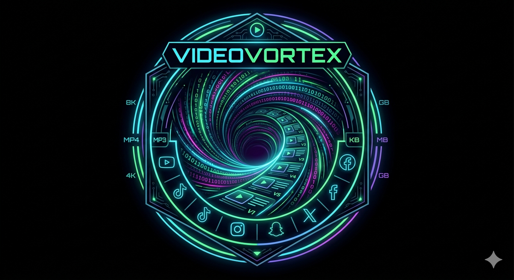
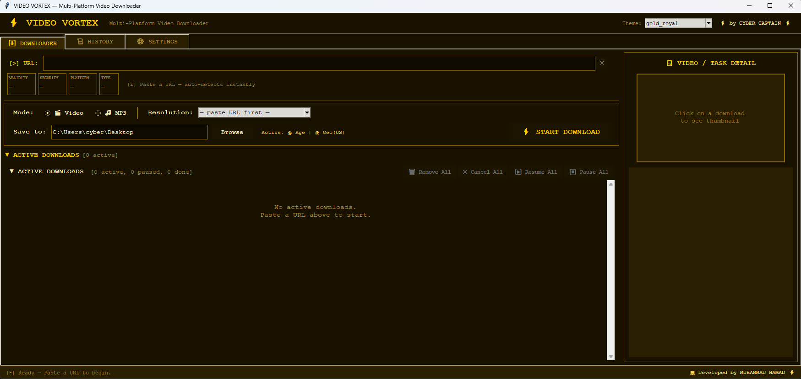

# 🚀 VideoVortex

<div align="center">



[](https://github.com/the-cybercaptain/VideoVortex/stargazers)

[](https://github.com/the-cybercaptain/VideoVortex/network)

[](https://github.com/the-cybercaptain/VideoVortex/issues)

[](LICENSE)

**A powerful, user-friendly desktop application for downloading videos from various online platforms with an intuitive graphical interface.**

</div>

## 📖 Overview

VideoVortex is a robust desktop application designed to simplify the process of downloading videos from a multitude of online sources. It provides a clean, intuitive graphical user interface (GUI) built with PyQt5, making video acquisition accessible to users of all technical levels. Leveraging the power of `youtube-dlp`, VideoVortex allows users to easily specify video URLs, select desired quality and format, and track download progress, streamlining content management for offline viewing or archival.

## ✨ Features

-   🎯 **Multi-Platform Video Downloading:** Download videos from a wide array of popular video hosting sites.
-   🖥️ **Intuitive Graphical User Interface:** A user-friendly desktop application built with PyQt5 for ease of use.
-   ⚙️ **Customizable Download Options:** Select preferred video quality, format, and other download parameters.
-   📊 **Real-time Download Progress:** Monitor the status of your video downloads with clear progress indicators.
-   📁 **Local File Management:** Easily access and manage your downloaded video files directly from the application.
-   🖼️ **Thumbnail Support:** Display video thumbnails for better organization and identification (speculative based on `Pillow` dependency).

## 🖥️ Screenshots

[](https://drive.google.com/file/d/14FDZQQefZzAiT48-0gmxd5KT2XmX-rR7/view?usp=sharing) 

*Click the screenshot above to watch the demo video*

## 🛠️ Tech Stack

**Runtime:**

[](https://www.python.org/)

**GUI Framework:**


**Core Libraries:**

[](https://github.com/yt-dlp/yt-dlp)

[](https://python-pillow.org/)

## 🚀 Quick Start

Follow these steps to get VideoVortex up and running on your local machine.

### Prerequisites

-   **Python 3.x**: Ensure you have a compatible version of Python installed.

### Installation

1.  **Clone the repository**
    ```bash
    git clone https://github.com/the-cybercaptain/VideoVortex.git
    cd VideoVortex
    ```

2.  **Install dependencies**
    ```bash
    pip install -r requirements.txt
    ```

3.  **Start the application**
    ```bash
    python main_gui.py
    ```

## 📁 Project Structure

```
VideoVortex/
├── core/                   # Core application logic and utilities
├── gui/                    # Graphical User Interface components and layouts
├── LICENSE                 # Project license file
├── main_gui.py             # Main entry point for the desktop application
├── main_ui_screenshot.png  # Screenshot of the main UI
├── requirements.txt        # Python dependency list
├── README.md               # This README file
└── VideoVortex.png         # Project logo
```

## 🔧 Development

### Running the Application

To run the application in development mode, simply execute the main GUI script:

```bash
python main_gui.py
```

### Development Workflow

Contributions and enhancements are welcome. The core logic is separated into the `core/` directory, while `gui/` handles the user interface.

## 🧪 Testing

Automated tests are not currently detected within the repository.

## ⚠️ Disclaimer & Educational Policy:

This tool is strictly developed for educational and research purposes to demonstrate network streams and GUI interaction. Please note that downloading copyright-protected media (such as high-definition YouTube streams beyond standard restrictions) may violate platform Terms of Service.The developer assumes no liability for misuse. Users are fully responsible for ensuring compliance with digital rights and legal policies when executing this application.

## 📄 License

This project is licensed under the [GNU General Public License v3.0](LICENSE) - see the [LICENSE](LICENSE) file for details.

## 🙏 Acknowledgments

-   Powered by [youtube-dlp](https://github.com/yt-dlp/yt-dlp) for comprehensive video downloading capabilities.
-   Utilizes [Pillow](https://python-pillow.org/) for image processing functionalities.

## 📞 Support & Contact

-   🐛 Issues: [GitHub Issues](https://github.com/the-cybercaptain/VideoVortex/issues)

---

<div align="center">

**⭐ Star this repo if you find it helpful!**

Made with ❤️ by [the-cybercaptain](https://github.com/the-cybercaptain)

</div>

